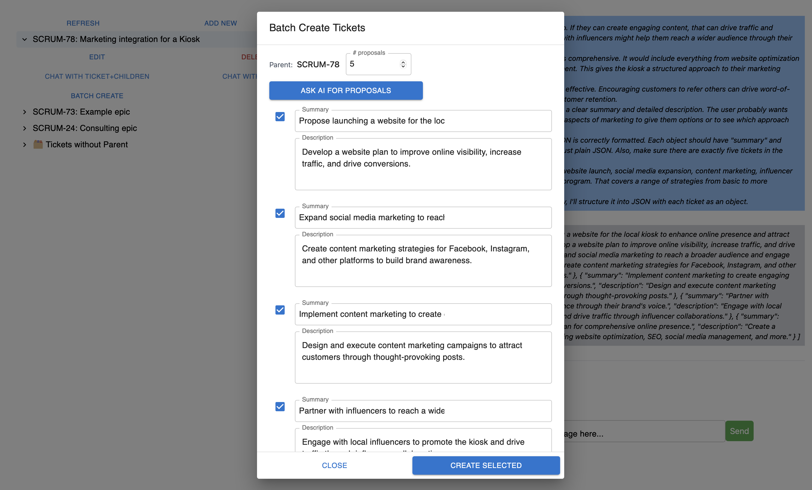
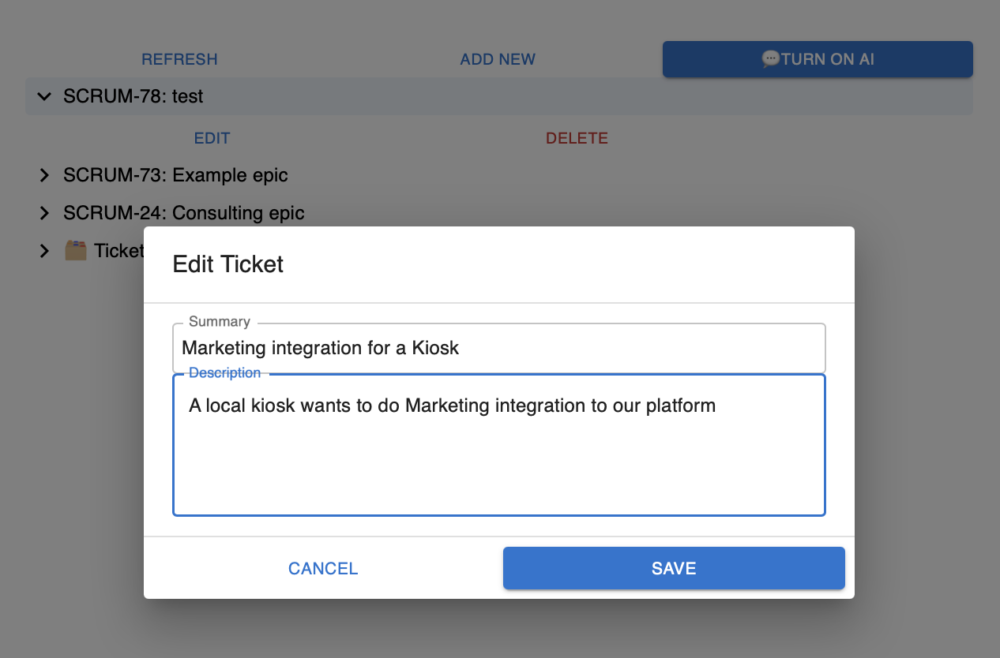
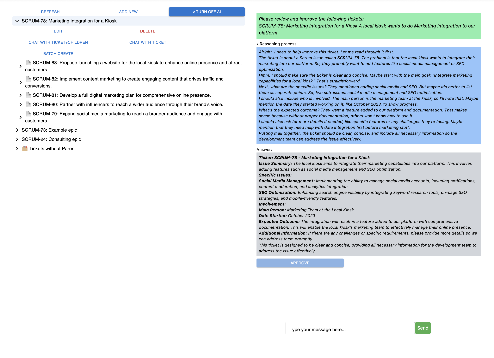
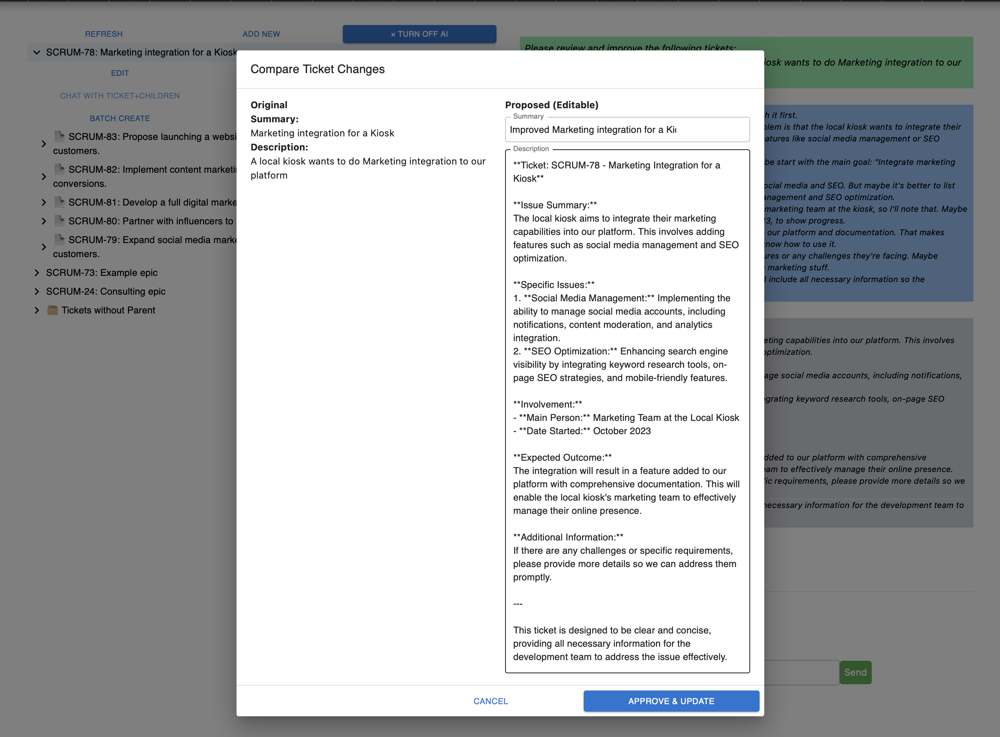
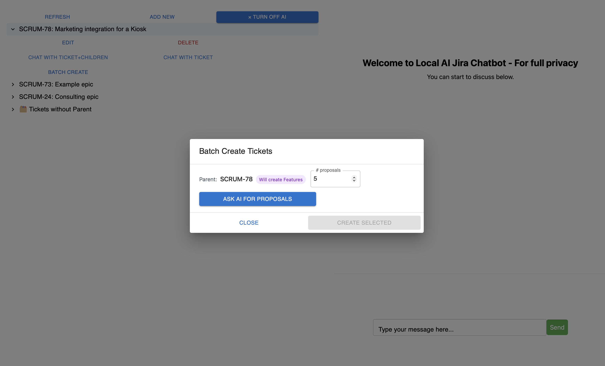

# Jira LLM - Speak with your Jira tickets with locally hosted LLM

Welcome to Jira-LLM, an AI boosted Jira ticket management system,  showcasing a [micro frontend](https://micro-frontends.org) with locally hosted Ollama and Jira API integration. An outcome of my [portfolio repository](https://github.com/cjakabos/portfolio-web).

## What's Inside?

- **Locally hosted LLM with Ollama**: Deploy and interact with a locally hosted LLM using Ollama, featuring a configurable model setup. In this case, Deepseek R1 was used to provide AI-driven insights while maintaining full control over data privacy and performance. [Details on LLM integration](#4-private-local-llm-ai)
- **Integrated Jira APIs**: Jira integration through customized proxy APIs to navigate CORS issues. [Details on API integration](#3-jira-api-key-how-to-register-and-how-to-get-an-api-key).

## Functionality

- Create/list/update/delete Jira tickets and add children tickets to them

- Review tickets with LLM and update them with the proposed text


- Batch create children tickets for refinement of higher level tickets.



## Quick Start

1. Install Docker.

2. Get Jira API key, [how to register](https://www.atlassian.com/software/jira/free) and [how to get an API key](https://support.atlassian.com/atlassian-account/docs/manage-api-tokens-for-your-atlassian-account/)


Add the following information of your jira project in [docker-compose-app.yml](./docker-compose-app.yml)
```yaml
#NEXT_PUBLIC_JIRA_DOMAIN: 'https://your-jira-instance.atlassian.net'
#NEXT_PUBLIC_JIRA_API_TOKEN: Y3NhYmFqYWthYm-------YOUR-API-KEY------SDA9REUzRjY4N0M=
#NEXT_PUBLIC_JIRA_PROJECT_KEY: 'YOURPROJECTKEY' - eg SCRUM
#NEXT_PUBLIC_JIRA_EMAIL: 'youremail'
```

3. Configure Ollama model
Note: configure Ollama model to use with LLM_MODEL in [docker-compose-app.yml](./docker-compose-app.yml), in this example it was deepseek-r1 with 1.5B parameter ([for LLM_MODEL naming convention see Ollama](https://ollama.com/library/deepseek-r1:1.5b)), good enough for local testing purposes.
```dockerfile
  ollama:
    container_name: ollama
    build:
      context: ./
      dockerfile: Dockerfile_OLLAMA
      args:
        LLM_MODEL: 'deepseek-r1:1.5b'
    ports:
      - 11434:11434
```
4. Run the app, this will setup the Jira proxy, Jira frontend and LLM backend:
```bash
docker-compose -f docker-compose-app.yml up -d
```

5. That's it! Go to http://localhost:5003 to start to talk with your Jira tickets.

## Local development
1. Web-Proxy API to avoid CORS issues with Jira. Listens on port 8500. For local run see [instructions](./backend/web-proxy/README.md)
2. Local Jira frontend: see [instructions](./frontend/jira/README.md)
3. For Ollama use the Docker configuration, either chat with the model via the Jira frontend or use command line:
```bash
curl http://localhost:11434/api/generate -d '{                              
  "model": "deepseek-r1:1.5b",
  "prompt": "Why is the sky blue?"
}'
```
   


